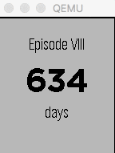

### Envato Tuts+ Tutorial: How to Build a Pebble Application

#### Instructor: Shaun Dunne

The Pebble watch is an alternative to Android Wear and Apple Watch in the smartwatch market. The Pebble smartwatch has been around since its very successful Kickstarter campaign in 2012 and is a popular choice amongst smartwatch users. In this introduction to Pebble development, I walk you through some of the basics of getting started with Pebble development using the SDK and the Pebble.js library by building an application and submitting it to the Pebble application store.

Source files for the Envato Tuts+ tutorial: [How to Build a Pebble Application](http://code.tutsplus.com/tutorials/how-to-build-a-pebble-application--cms-26174)

**Read this tutorial on [Envato Tuts+](https://code.tutsplus.com)**.

